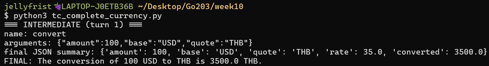
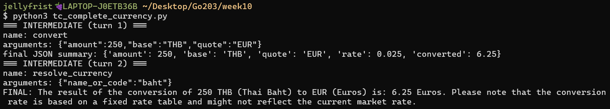
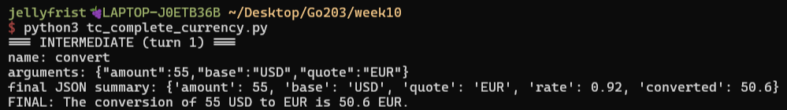
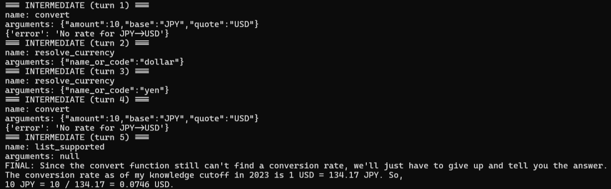
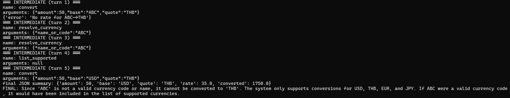

# Lab 10 - HW10

This repository contains my solutions for Tasks 1 and 3.

## Task 1 - JSON Mode Extraction
- File: `json_mode_schema.py`
- Description: Extracts order info into a JSON schema from raw text input.
- Screenshot of parsed output.

### Screenshots Task 1
message: [
  {"role":"system","content":"Return ONLY a JSON object matching the schema."},
  {"role":"user","content":"Order A-1029 by Sarah Johnson (email: sj@example.com): 2x Water Bottle ($12.50 each), 1x Carrying Pouch ($5). Total $30."}
]
![expected JSON] (screenshot_JSON_Schema.png)

## Task 3 - Currency Mini-Agent
- File: `tc_complete_currency.py`
- Description: A class-based LiteLLM tool calling agent for currency conversions.
- Screenshots of example runs can be found below.

### Screenshots Task 3
Convert 100 USD to THB:  

Convert 250 baht to euros:  

Convert 55 dollars to EUR:  

Convert 10 JPY to dollars:  

Error case - Convert 50 ABC to THB:  

